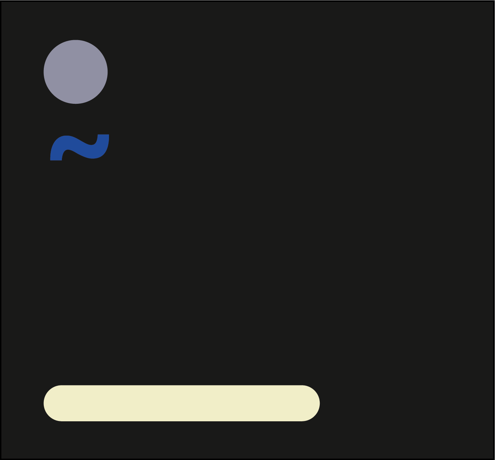

<div id="top"></div>
<!-- PROJECT LOGO -->
<br />
<div align="center">
  <a href="https://github.com/kikiloveyou-0/Archeum">
    
  </a>

  <h3 align="center">Archeum</h3>
</div>

<!-- ABOUT THE PROJECT -->
## About The Project

Archeum is a minimalist text editor that is really usefull if you've been in the vim psychosis for to long.

* Reject plugins, return to basic monke
* Great for psychotic people that are insane about how 
  great vim shortcuts are 
  and want to find inner peace being completely ouside of hypocrisy.

The project is still under development so let me know if i should add something.


### Built With
* [Rust](https://www.rust-lang.org/)

<!-- GETTING STARTED -->
## Getting Started

### Prerequisites

You need to have Rust installed.

### Installation

First
* clone the repo
  ```sh
  git clone https://github.com/kikiloveyou-0/Archeum
  ```
* cd in the projet 
  ```sh
  cd Archeum
  ```
* build the project
  ```sh
  cargo run
  ```
<!-- ROADMAP -->
## Roadmap

- [x] Add Screen
- [x] Add Cursor
- [ ] Add Writing
- [ ] Save System

<!-- LICENSE -->
## License

Distributed under the MIT License. See `LICENSE.txt` for more information.
